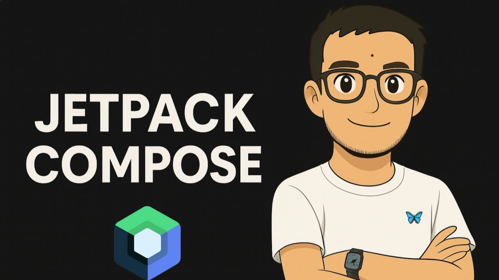

# 
Hola, soy <a href="https://www.henki.com.ve/" target="_blank" style="text-decoration: none; color: #4285F4;">Eiborth</a> 👋

  <!-- Aquí puedes colocar un banner personalizado con la identidad visual de Henki (puedes usar un diseño basado en image_6e3a86.jpg) -->
  

  
  
  
  

---

## Sobre mí

* 📱 **Senior Mobile Developer** especializado en desarrollo nativo con un fuerte enfoque en la creación de ecosistemas de productos propietarios.
* 🚀 **Scrum Master** apasionado por la gestión ágil, la optimización de flujos de trabajo y la arquitectura limpia de software.
* 🎓 **Creador de contenido educativo** en **Henki**, un estudio de software dedicado a construir aplicaciones, juegos y experiencias de aprendizaje ágiles y técnicas.

---

## 📚 Cursos Destacados (Henki)

Presentamos formación técnica y metodológica diseñada para potenciar habilidades reales:
<table>
  <tr>
    <td width="50%" align="center">
      
        
      <strong>Aprende Gestión Ágil de Proyectos</strong>  
      Domina Scrum desde cero y lidera equipos con metodologías ágiles en proyectos del mundo real.  
      <a href="https://www.youtube.com/playlist?list=PLE1nGr44V0Eo0oEwVLSXkn36HcqrK1yNw" target="_blank">🎬 Ver Curso</a>
    </td>
    <td width="50%" align="center">
      
        
      <strong>Jetpack Compose Guía Moderna</strong>  
      Aprende a diseñar interfaces móviles fluidas y modernas en Android utilizando arquitectura MVVM.  
      <a href="https://www.youtube.com/playlist?list=PLE1nGr44V0ErCMvoYCl220X79zzvDyK4r" target="_blank">🎬 Ver Curso</a>
    </td>
  </tr>
  <tr>
    <td width="50%" align="center">
      
        
      <strong>DevOps Práctico desde Cero</strong>  
      Automatiza despliegues y asegura tus entornos web mediante pipelines de integración continua (CI/CD).  
      <a href="https://www.youtube.com/playlist?list=PLE1nGr44V0Eq-TnVK3k4uBJhWPFIQUBIv" target="_blank">🎬 Ver Curso</a>
    </td>
    <td width="50%" align="center">
      
        
      <strong>MySQL y Optimización de Bases de Datos</strong>  
      Aprende a crear consultas rápidas, eficientes y con bases totalmente estables.  
      <a href="https://www.youtube.com/playlist?list=PLE1nGr44V0EqMC_-A3_o3Yv6ut5bFDJ-f" target="_blank">🎬 Ver Curso</a>
    </td>
  </tr>
</table>

---

## 📱 Disfruta de nuestras aplicaciones

Explora el universo de productos móviles que desarrollamos de manera nativa e independiente, todos diseñados bajo un formato vertical optimizado:

### 🌌 Noise App
* **Propósito:** Audios y sonidos para calmar la mente (lluvia, viento y mar) acompañados de un temporizador de apagado diario. Funciona ideal sin conexión v4.
* [🤖 Descargar App en Play Store](https://play.google.com/store/apps/details?id=com.henki.noise)

### 🍅 Pomodoros
* **Propósito:** Multiplica tu enfoque laboral mediante un reloj visual limpio y bloques fijos de 25 minutos estructurados en un diseño minimalista.
* [🤖 Descargar App en Play Store](https://play.google.com/store/apps/details?id=com.henki.pomodoros)

### 🔒 Lockly
* **Propósito:** Multiplica tu seguridad digital de manera simple mediante la generación de claves seguras y aleatorias de 25 caracteres.
* [🤖 Descargar App en Play Store](https://play.google.com/store/apps/details?id=com.henki.lockly)

---

  <i>Todos los cursos, apps y juegos en un solo universo. Entra al mundo Henki. 🦋</i>

